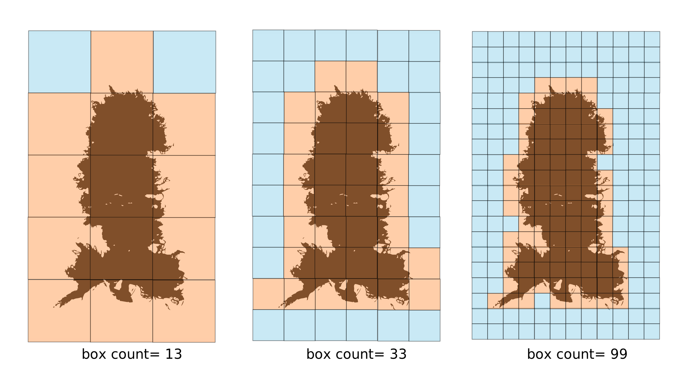
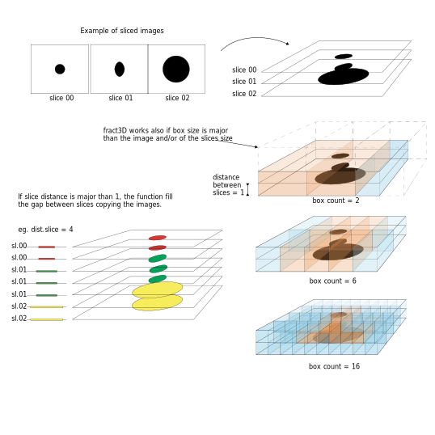
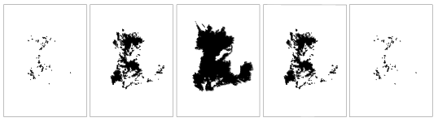

<!-- README.md is generated from README.Rmd. Please edit that file -->
# fractD

<!-- badges: start -->
<!-- badges: end -->
The goal of fractD is to ...

## Installation

You can install the released version of fractD from [CRAN](https://CRAN.R-project.org) with:

``` r
install.packages("fractD")
```

And the development version from [GitHub](https://github.com/) with:

``` r
# install.packages("devtools")
devtools::install_github("mfpok/fractD")
```

The package `fractD` contains two fuctions `fract2D` and `fract3D` that allow to estimate the fractal dimension (D) of 2D and 3D images. Fractal dimension is estimated by the method of box-counting. Box-counting method is useful to calculate the fractal dimension of various sets of any dimension and patterns with or withouth self-similarity (Klinkenberg, 1994). The method overlay a series of squares (for `fract2D`) or cubes (for `fract3D`) of different sizes. Then, for each size step the functions keep track of the number of squares or cubes occupied by the black area into the image. Finally, the fractal dimension (D) is estimated by linear regression of log(n°boxes) on log(box.size).

The following illustration show the rational behind the function `fract2D`:



## Example

Here an example of applying `fract2D` to the following image: 

``` r
library(fractD)
## basic example code for fract2D
fct2D <- fract2D(dir = "vignettes/examples/source.dir", box.size = c(1,2,4,8,16,32,64,128,256,512))

## the following code saves the data in a file named "es3D.rds" into the "output"" folder 
## not run ## 
##fct2D <- fract2D(dir = "examples/source.dir", box.size = c(1,2,4,8,16,32,64,128,256,512), save.dir = "examples/output/", save.name = "es2D")
```

``` r
# the function create a list with two objects: 
fct2D$D # Estimated fractal dimension
#>      id      D
#> 1 fig_1 1.7669

fct2D$raw.dat # Raw data from which fractal dimension was calculated 
#>       id box.size    box
#> 1  fig_1        1 328905
#> 2  fig_1        2  86845
#> 3  fig_1        4  23155
#> 4  fig_1        8   6207
#> 5  fig_1       16   1681
#> 6  fig_1       32    462
#> 7  fig_1       64    135
#> 8  fig_1      128     44
#> 9  fig_1      256     17
#> 10 fig_1      512      6
```

The following illustration show the rational behind the function `fract3D`:



## Example

Here an example of applying `fract3D` to the following image:



``` r
library(fractD)
## basic example code for fract3D
# save.dir and save.name provide optional 
fct3D <- fract3D(dir = "vignettes/examples/source.dir", dist.slice = 10, box.size = c(1,2,4,8,16,32,64,128,256,512))

## the following code saves the data in a file named "es3D.rds" into the "output"" folder 
## not run ## 
## fct3D <- fract3D(dir = "examples/source.dir", dist.slice = 1, box.size = c(1,2,4,8,16,32,64,128,256,512), save.dir = "examples/output/", save.name = "es3D")
```

``` r
# the function create a list with two objects: 
fct3D$D # Estimated fractal dimension
#>          id      D
#> 1 es_3D_img 2.2215

fct3D$raw.dat # Raw data from which fractal dimension was calculated 
#>           id box.size     box
#> 1  es_3D_img        1 4816960
#> 2  es_3D_img        2  759820
#> 3  es_3D_img        4  120164
#> 4  es_3D_img        8   22632
#> 5  es_3D_img       16    4066
#> 6  es_3D_img       32     736
#> 7  es_3D_img       64     135
#> 8  es_3D_img      128      43
#> 9  es_3D_img      256      17
#> 10 es_3D_img      512       6
```

## References

-   Mandelbrot B.B. (1982) - . San Francisco: W.H. Freman.
-   Klinkenberg B. (1994) - . Mathematical Geology, vol. 26, n° 1.
-   Dubuc B., Quiniou J.F., Roques-Carmes C., Tricot C., Zucker S.W. (1989) - . Physical Review A, vol. 39, n° 3.
-   Taud H and Parrot J-F (2005) - . Géomorphologie: relief, processus, environnement: 4, 327-338.
